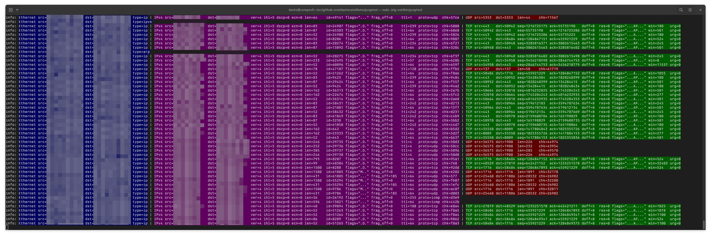
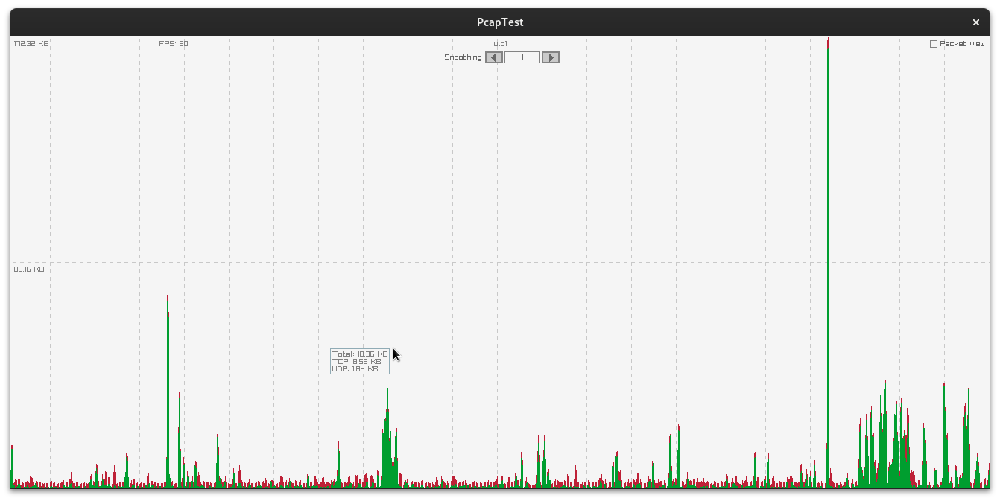

## Pcaptest

Small toy written in zig that decodes network packets.

Packets are captured using `libpcap` and graphed with a GUI made with `raylib`.
The packet headers are printed to the terminal and they're processed.

